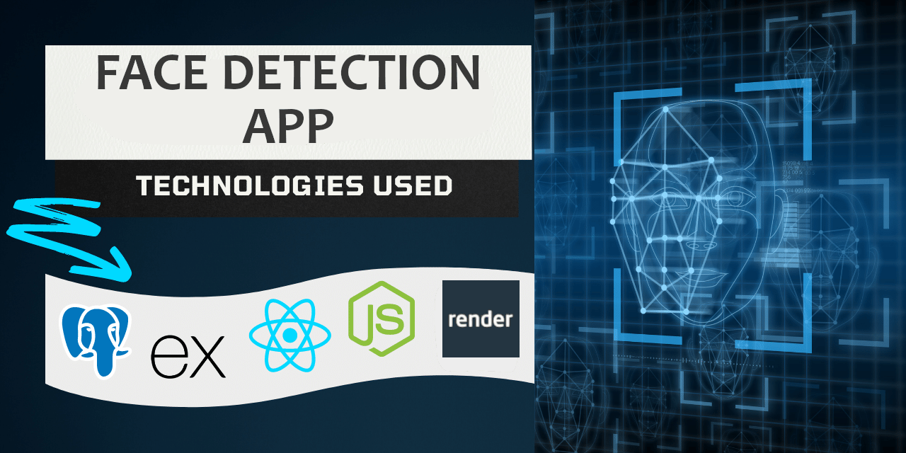

    <h1>Fullstack Face Detection App</h1>
    <h4>(Portfolio Project)<h4>
    <h3> 
      Live Demo Link: <a href='https://devon-facedetection-app.onrender.com/', target='_blank'>
        devon-facedetection-app.onrender.com
      <a/>
    </h3>
     

<!-- Logo -->

    

        
    

    <h6>
        built with <a href="https://react.dev/">React.js</a> &
        hosted by <a href="https://render.com/">Render</a> 
    </h6>

&nbsp;

&nbsp;

&nbsp;

&nbsp;

 

##  About this project

Welcome to the Face Recognition Web App! This web application utilizes the power of Clarifai's deep learning AI platform to detect and locate human faces in images. With its user-friendly interface and integrated authentication system, this app provides a seamless experience for users to upload images, detect faces, and track their ranking.

This project is built using the PERN stack, a powerful combination of PostgreSQL, ExpressJS, ReactJS, and NodeJS. PostgreSQL serves as the open-source relational SQL database, ExpressJS is the backend web application framework, ReactJS powers the frontend, and NodeJS provides the runtime environment.

Additionally, the project integrates several other technologies and libraries to enhance the user experience. These include Clarifai for deep learning image recognition, Tachyons for CSS styling, React-Parallax-Tilt for logo animation, tsParticles for the captivating background animation, and React-dom for DOM-specific methods.

<strong>Link to Backend Repository:</strong>  [FaceDetectionApp-BackEnd](https://github.com/DevonGifford/FaceDetectionApp-BackEnd)

 

### Key Features
---

- <strong>Image Recognition:</strong>  The app leverages Clarifai's face recognition machine learning model to accurately detect and locate human faces within uploaded images.

- <strong>User Authentication:</strong>  Built-in user authentication ensures secure login and password hashing to protect user credentials.

- <strong>Ranking System:</strong>  Each time the face detection service is triggered, the user's ranking is updated, allowing them to track their progress and see how many faces they have successfully detected.

- <strong>Custom REST API:</strong>  The backend of the web app is powered by a custom REST API that handles user data and encrypted password storage using SQL transactions.

 

### Project Improvements: 
---
- <strong>Multiple-Face Detection:</strong>  Implemented the capability to detect multiple faces within an uploaded image, enhancing the accuracy and versatility of the face recognition feature.

- <strong>Loading Screen:</strong>  Added a loading screen or spinner animation to provide visual feedback to the user while the image processing and face detection are in progress, improving the overall user experience.

- <strong>Demo Account Log-in:</strong>  Implemented a demo account login feature, allowing users to explore the application without the need for creating an account. This feature provides a convenient way for users to test the app's functionalities and experience its core features.

 

### But wait, why are you using class based components?
---

Although modern React tends to favor functional components, I deliberately chose to utilize class-based components in this project. This decision was driven by a desire to gain a deeper understanding of React's history and the evolution of its component system. Working with class-based components provided me with valuable insights into older codebases and allowed me to explore React's earlier approaches to building reusable UI elements.

By choosing class-based components, I aimed to broaden my knowledge and skills in React development, ensuring that I have a well-rounded understanding of both functional and class-based approaches. This experience not only enhanced my familiarity with React's component lifecycle methods but also provided me with the opportunity to work with legacy codebases and gain insights into how React has evolved over time.

Understanding class-based components is crucial when maintaining or contributing to existing projects that still rely on this paradigm. It enables me to effectively collaborate with teams working on different React codebases and adapt to varying development practices. Additionally, learning about class-based components allows me to appreciate the advancements made in React's functional component paradigm and understand the motivations behind its adoption.

By choosing to work with class-based components in this project, I not only gained a deeper understanding of React but also expanded my toolkit as a React developer. This knowledge empowers me to navigate diverse codebases, contribute to open-source projects, and tackle a wide range of React development challenges.

 

###  List of Tech & Libraries used:
---

#### Frontend:
- [Clarifai](https://www.clarifai.com/): deep learning AI platform for modeling unstructured image, video, text, and audio data.
- [Tachyons](https://tachyons.io/): CSS Toolkit for styles
- [React-Parallax-Tilt](https://www.npmjs.com/package/react-parallax-tilt): for tilting animation on logo
- [tsParticles](https://particles.js.org/): For background animation
- [React-dom](https://legacy.reactjs.org/docs/react-dom.html) package provides DOM-specific methods that can be used at the top level

#### Backend:
- [bcrypt-nodejs](https://www.npmjs.com/package/bcrypt-nodejs): password encryption and hashing
- [body-parser](https://www.npmjs.com/package/body-parser): parse request bodies
- [Clarifai](https://www.clarifai.com/): deep learning AI platform
- [cors](https://www.npmjs.com/package/cors): Cross-Origin Resource Sharing
- [dotenv](https://www.npmjs.com/package/dotenv): load environment variables
- [express](https://expressjs.com/): web application framework
- [knex](https://knexjs.org/): SQL query builder
- [pg](https://www.npmjs.com/package/pg): PostgreSQL client

#### Additional hosting:
- [Render](https://render.com/): Server, Database & Front-end hosting

 
